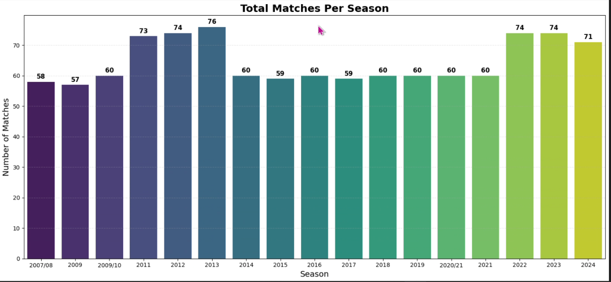

# 🏏 IPL Analytics Project (Data Analysis & Visualization)

This project analyzes IPL match and ball-by-ball datasets (`matches.csv` & `deliveries.csv`) to uncover meaningful insights about teams, players, match outcomes, and performance patterns.  
A complete data exploration is performed along with highly unique and modern visualizations (circular charts, funnel diagram, flow charts, polar plots, parallel categories, etc).

---

## 🎥 Project Demo Video

---

## 📊 **Project Highlights**

### ✔️ Key Visualizations
This project contains **unique, modern and clean charts**:
- Circular Bar Chart (Top Wicket Takers)
- Funnel Chart (Match Win Margin)
- Flow Diagram (Toss Winner → Match Winner)
- Polar Plot (Boundary Distribution)
- Parallel Categories (MVP Skill Flow)
- Stadium Performance Analysis
- Run Rate Trends
- Team Win Pattern Analysis

---

## 🗂️ **Dataset Used**
### **1️⃣ matches.csv**
Contains match-level information:
- Match ID  
- Venue  
- Toss Decision  
- Winner  
- Result (runs / wickets)  
- Umpires  
- Player of Match  

### **2️⃣ deliveries.csv**
Ball-by-ball dataset:
- Batter  
- Bowler  
- Runs  
- Wickets  
- Extras  
- Dismissal Details  

---

## 🧹 **Data Cleaning & Processing**
- Handling missing values  
- Standardizing team names  
- Calculating total runs, wickets, boundaries  
- Deriving strike rate, economy, powerplay stats  
- Filtering super over balls  
- Merging datasets where necessary  

---

## 📈 **Main Insights**
- Toss win has **low correlation** with match result  
- Chasing teams win more matches  
- Kohli, Rohit, Warner → Most consistent run scorers  
- Bravo, Chahal → Most impactful bowlers  
- MS Dhoni → High value due to keeping & finishing skills  
- Stadiums play a **huge role** in match outcome  
- More matches decided in last 2 overs in recent years  

A complete list of actionable insights is inside the project notebook.

---

## 🚀 **Tech Stack**
- Python  
- Pandas  
- NumPy  
- Matplotlib  
- Seaborn  
- Plotly  
- Jupyter Notebook  

---

👤 Created by [SAMEE KHAN ](https://github.com/samee-khan777)
